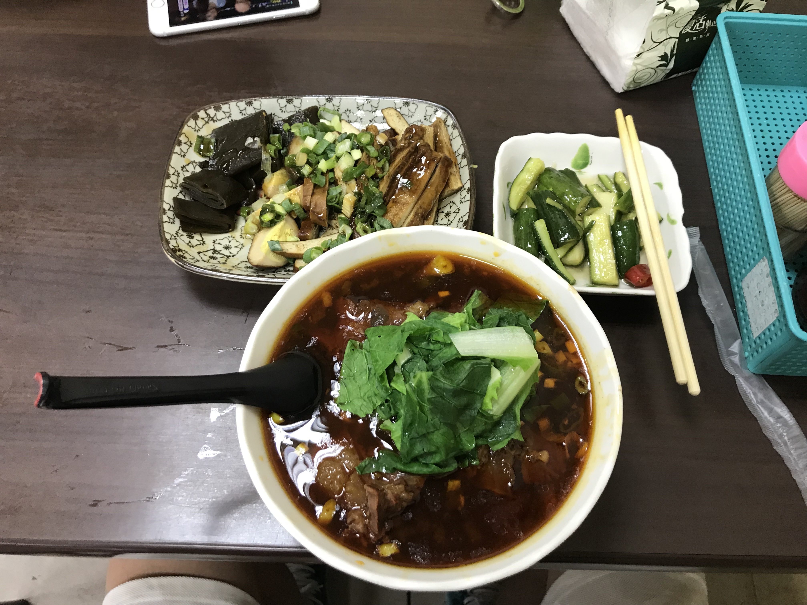

<!DOCTYPE html>
<html lang="en">

<head>
    <meta charset="UTF-8">
    <title>第二堂課練習</title>
    <link rel="stylesheet" type="text/css" href="http://yui.yahooapis.com/3.18.1/build/cssreset/cssreset-min.css">
    <link rel="stylesheet" href="style.css">
    
</head>

<body>
    <h1>第二堂課練習</h1>
    <ul>
        <li> <a href="http://www.google.com" target="_blank">第1段</a> <a href="http://www.google.com" target="_blank">第2段</a> <a href="http://www.google.com" target="_blank">第3段</a> <a href="http://www.google.com" target="_blank">第4段</a> <a href="http://www.google.com" target="_blank">第5段</a> </li>
    </ul>
    <ul>
        <li><a href="HW1/hw1.html">hw1</a></li>
        <li><a href="HW2/hw2.html">hw2</a></li>
        <li><a href="#article3">第3篇</a></li>
        <li><a href="#article4">第4篇</a></li>
        <li><a href="">第5篇</a></li>
    </ul>
    

        <h2>第1篇文章</h2>
        <h3>我是小標題</h3>
        
Lorem ipsum dolor sit amet, consectetur adipisicing elit. Modi facilis perferendis, rerum possimus a facere beatae fuga vitae nesciunt quasi provident dolorum tempora atque suscipit at ea voluptas voluptatem, maiores.
 
        
    

    <h2>第2篇文章</h2>
    <h3>我是小標題</h3>
    
Lorem ipsum dolor sit amet, consectetur adipisicing elit. Modi facilis perferendis, rerum possimus a facere beatae fuga vitae nesciunt quasi provident dolorum tempora atque suscipit at ea voluptas voluptatem, maiores.
 
    
    <h2 id="article3">第3篇文章</h2>
    <h3>我是小標題</h3>
    
Lorem ipsum dolor sit amet, consectetur adipisicing elit. Modi facilis perferendis, rerum possimus a facere beatae fuga vitae nesciunt quasi provident dolorum tempora atque suscipit at ea voluptas voluptatem, maiores.Lorem ipsum dolor sit amet, consectetur adipisicing elit. Modi facilis perferendis, rerum possimus a facere beatae fuga vitae nesciunt quasi provident dolorum tempora atque suscipit at ea voluptas voluptatem, maiores.Lorem ipsum dolor sit amet, consectetur adipisicing elit. Modi facilis perferendis, rerum possimus a facere beatae fuga vitae nesciunt quasi provident dolorum tempora atque suscipit at ea voluptas voluptatem, maiores.
 
    
    <h2 id="article4">第4篇文章</h2>
    <h3>我是小標題</h3>
    
Lorem ipsum dolor sit amet, consectetur adipisicing elit. Modi facilis perferendis, rerum possimus a facere beatae fuga vitae nesciunt quasi provident dolorum tempora atque suscipit at ea voluptas voluptatem, maiores.Lorem ipsum dolor sit amet, consectetur adipisicing elit. Modi facilis perferendis, rerum possimus a facere beatae fuga vitae nesciunt quasi provident dolorum tempora atque suscipit at ea voluptas voluptatem, maiores.Lorem ipsum dolor sit amet, consectetur adipisicing elit. Modi facilis perferendis, rerum possimus a facere beatae fuga vitae nesciunt quasi provident dolorum tempora atque suscipit at ea voluptas voluptatem, maiores.
 
    
    <table style="border:solid black 3px;" rules="all" cellspacing="10" cellpadding="20">
        <tr>
            <td>姓名</td>
            <td colspan="2">電話</td>
        </tr>
        <tr>
            <td>第二列第一欄</td>
            <td rowspan="2">第二列第二欄</td>
            <td>第二列第三欄</td>
        </tr>
        <tr>
            <td>第三列第一欄</td>
            <td>第三列第二欄</td>
        </tr>
    </table>
     
    <table style="border:solid black 3px;" rules="all" cellspacing="10" cellpadding="20">
        <tr>
            <td></td>
            <td></td>
            <td></td>
        </tr>
        <tr>
            <td></td>
            <td></td>
            <td></td>
        </tr>
        <tr>
            <td></td>
            <td></td>
            <td></td>
        </tr>
    </table>
    

        <h2></h2>
        <h3></h3>
        

        
    

    

        <h2></h2>
        <h3></h3>
        

        
    

    

        <h2></h2>
        <h3></h3>
        

        
    

    

        <h2></h2>
        <h3></h3>
        

        
    

</body>

</html>
